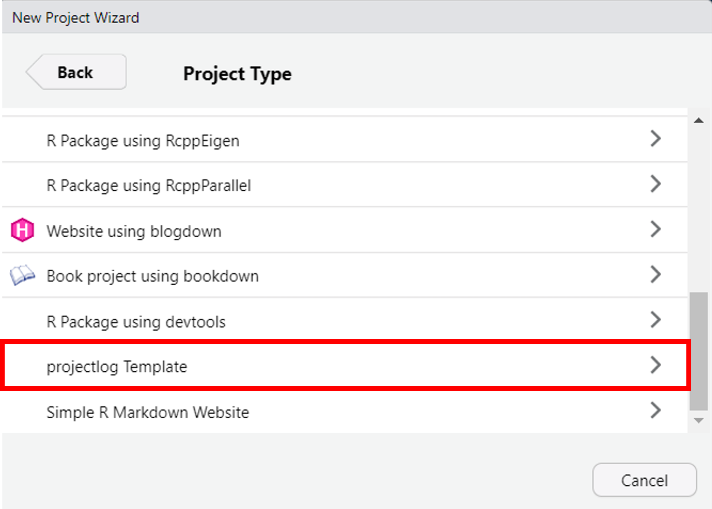

```{r, include = FALSE}
knitr::opts_chunk$set(
  collapse = TRUE,
  comment = "#>"
)
```

```{r setup}
library(projectlog)
```

**TO BE EXPANDED SOON**

Below are brief examples of how `projectlog` can be used over the course of your project.

### Initiating your project

```{r, eval=TRUE, echo=FALSE, message=TRUE, fig.height = 2}

```

```{r, eval=TRUE,echo=TRUE}
#> ── Create project folder structure ───────────────────────────────────────────────────────────────────────────────────
#> Loaded 'groundhog' (version:2.2.1)
#> Tips and troubleshooting: https://groundhogR.com
#> ✔ Initiated `groundhog` for managing package dependencies ('dependencies.R')

#> ── Add necessary files ───────────────────────────────────────────────────────────────────────────────────────────────
#> ✔ 'project_log/MD5'
#> ✔ README file: README.Rmd
#> ✔ Preregistration: test-repo/preregistrations/preregistation.Rmd

#> ── Configuring Git ───────────────────────────────────────────────────────────────────────────────────────────────────
#> ✔ Working version of Git found!
#> ✔ Git was configured successfully.
#> ✔ Setting active project to 'C:/Repositories/test-repo'
#> ✔ Adding '.Rproj.user', '.Rhistory', '.Rdata', '.httr-oauth', '.DS_Store' to '.gitignore'
#> There are 6 uncommitted files:
#> * '.gitignore'
#> * 'dependencies.R'
#> * 'preregistrations/'
#> * 'project_log/'
#> * 'README.Rmd'
#> * 'test-repo.Rproj'
#> Is it ok to commit them?

#> 1: Yes
#> 2: No
#> 3: Not now

#> Selection: 1
#> ✔ Adding files
#> ✔ Making a commit with message 'Initial commit'
#> ✔ Creating private GitHub repository 'StefanVermeent/test-repo'
#> ✔ Setting remote 'origin' to 'https://github.com/StefanVermeent/test-repo.git'
#> ✔ Pushing 'master' branch to GitHub and setting 'origin/master' as upstream branch
#> ✔ Opening URL 'https://github.com/StefanVermeent/test-repo'
```

TBD

## Logging project milestones to GitHub

Milestones are any major update to your project that you want to give a special tag.
Examples are timestamping a preregistration, a final version of analysis code, submission of a manuscript, etc.
In other words, milestones are the events in your project history that you want to point out to reviewers and/or future interested readers.

Let's say that you finished your preregistration and want to mark it as a timestamped version in GitHub.
In order to do this, you would use the `log_milestone` function:

```{r, eval=F, echo=T}
log_milestone(
  "preregistrations/preregistration.md", 
  commit_message = "Timestamped preregistration for study 1", 
  tag = "preregistration"
  )
```


`log_milestones` takes three arguments.
The first argument (...) takes all the files that you want to include in this commit.
You can use either use "." to include all currently modified files, or you can include specific files only (e.g., only the preregistration files. See `show_changes()` for an overview of all modified files).
The second argument (commit_message) can be used to give your milestone an informative commit.
For example, you can use the commit_message to give the reader more information about the scope and type of the preregistration.
The third argument (tag) is a unique tag that defines this milestone.
You should use the same tag across all milestones that achieve the same thing.
For example, if you register three preregistrations over the course of your project, all of them should get identical tags (e.g., 'preregistration').

`projectlog` does not come with predefined tags, but instead gives you the freedom to name the tags yourself.
The only requirement is that the tag does not contain spaces and does not end with a number.
The latter requirement is necessary because `projectlog` automatically appends a number to your tab if the same tag was used before.
For example, if you've used the tag 'preregistration' before to timestamp the preregistration for your first study, and later on use the same tag again to timestamp the preregistration for your second study, `projectlog` will automatically change the new tag to 'preregistration1'.
The reason for this is that Git tags need to be unique strings.
When summarizing your project history later on, the same tags will be grouped together.

This freedom to define your own tag comes with a trade-off: you will have to be careful that you do not make typos, and that new tags exactly match previous tags (e.g., if you use 'preregistration' at one point and 'prereg' at a later point, these will be seen as two different types of milestones).
Below, we list some examples of tags that might come in handy for many empirical projects:

    - 'preregistration'
    - 'code'
    - 'submission'
    - 'revision'

## Logging regular changes to GitHub

Aside from logging important milestones, it is good practice to regularly log changes to your repository to GitHub.
This ensures that you can always go back to previous versions of your project, and that your code is safe if your PC crashes.
For the most part, these intermediate changes are not important enough to be considered milestones.
For example, they might be incremental updates to your code, bug fixes, and various intermediate versions of your manuscript.
To log these changes, you would use the `log_changes()` function:

```{r, eval=F, echo=T}
log_changes(".", commit_message = "add data exclusions to analysis script")
```

As you can see, `log_changes()` is very similar to `log_milestone()`.
The only difference is that `log_changes()` does not create a tag that get's added to the commit.


## Logging data access

One special type of milestone that `projectlog` allows you to log is the first time you access certain parts of your data.
It is becoming increasingly common to conduct secondary data analyses on existing data following open science principles.
This is helped, for example, by specific [preregistration templates for secondary data](https://osf.io/x4gzt/).
In addition, several established openly available datasets---such as the [ABCD study](https://abcdstudy.org/)---actively encourage using the Registered Report format.
In such cases, you might want to document that you only accessed the data after writing your preregistration or after obtaining Stage 1 acceptance of your Registered Report.
You might even want to explore isolated parts of the data without making crucial links between dependent and independent variables---for example, making sure that there is enough variation in key variables.
`projectlog` allows you to automatically log your access to the data.

```{r, eval=FALSE, echo=TRUE}
read_data(
  file = "data/data.csv", 
  read_fun = "read_csv", 
  col_select = c(id, iv1, iv2), 
  row_shuffle = "id")
```

## Creating your project log

TBD

